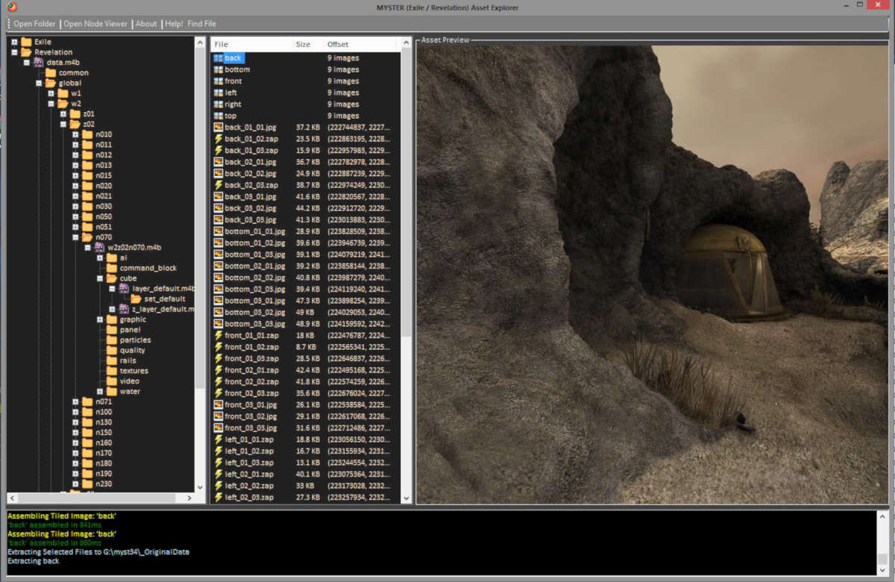

# MYSTER Asset Explorer

## An asset explorer for the games Myst 3 and Myst 4

## Features
- Load ALL the data in one go! Stick all the data files from both Exile and Rev in one folder and you can load them all at one time for easy browsing.
- Easily browse through nested .m4b and find interesting stuff without any extracting!
- .zap files are viewable, and extract as normal .jpg images
- Automatic assembly of Revelation’s tiled cubemap faces

## Known Issues
- Bink extraction from Exile (m3a) works incorrectly. Most videos will extract but have glitches or errors
- Does not handle extracting sound/music from sb0 files (only matters for Revelation)
- Might still be buggy/rough around the edges.
- Last m4b in nested m4b doesn't seem to be indexed correctly (waternight.m4b or something has blank contents)
- Shared and common .m4b wrong format, at the least make more clear they fail to open (since may not be able to figure out how to open)
- Some m4bs aren't correctly formatted -- need a better way to handle them / display them (they should be extractable themselves if not openable)

## UX Issues
- double clicking folder in file explorer should open that folder (in folder explorer & file explorer)
- Extraction causes UI Blocking, should be moved to separate thread

## Questions

- Apparently M4B CAN have both files and subfolders in the same directory.
DragonUnpacker seemed to work on the assumption that a folder had one or the other. Need to confirm DUP was neglecting to show certain files

## Future Development

I always planned to extend it so that it could save and load a registry file (xml) and make it possible to construct and save a registry of what files belong to what node (for Exile).

Then you could browse it a bit more like Revelation, navigating by node
Also I intended to implement a viewer so you can see a given node's cubemap all at once.

## Used For
This program was made for use in the [Tomahna Project](http://tomahna.pro/). Check it out!
